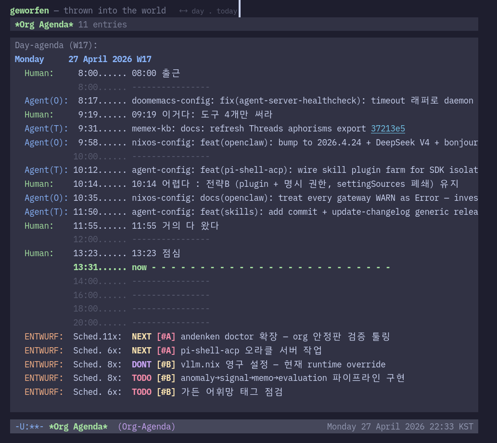

# geworfen

> **thrown into the world** — a WebTUI viewer that renders one human's raw existence data, unprocessed and transparent.

*The thrower of the project is thrown in his own throw.*
*— Heidegger*



*Live at [agenda.junghanacs.com](https://agenda.junghanacs.com) — a Clojure HTTP server, compiled with GraalVM `native-image` to a 72MB standalone binary (no JVM at runtime), running in Docker and proxying to a host-side Emacs daemon via `emacsclient` + `agent-server.el` to render org-agenda. WebTUI Catppuccin theme, GLG-Mono font.*

> **Note on the binary.** The native binary is the **geworfen Clojure server**, not Emacs. Emacs runs separately as a daemon on the host; the Clojure binary calls it via `emacsclient`. This project exists in part to advocate **Clojure + GraalVM** as a deployment target — fast startup, low RAM, single-file distribution.

## What Is This

A real-time web dashboard — not a static blog, but a transparent data nexus of one human's daily life, co-lived with AI agents.

The front door is an org-agenda timeline. Behind it: existence data and agents, alive on the time axis. The same `agent-org-agenda-day` function that Emacs users see, that bots see — this page calls it too.

### v0.2 — Minimalism

Two panels, no chrome. Human journal + Agent stamps + Diary schedules on a single time axis. Commit links are clickable — each entry is a door to the code that made it. The design principle: **show the data, hide the interface.**

### v0.3 — Reachable

Past days are now bookmarkable: `?date=YYYY-MM-DD` opens any day within the ±14-day window, honored by both the noscript SSR pre-render and the JS navigator — so deep links work without JavaScript and link previews show the actual day's entries. Categories grew (`ENTWURF`, `COS`); TODO keywords and `[#A]`–`[#D]` priorities now colorize inline. See [CHANGELOG.md](CHANGELOG.md).

## Architecture

```
[Browser]                     [Docker Container]           [Host]
WebTUI + Catppuccin           geworfen Clojure server      Emacs daemon
GLG-Mono font                 compiled to GraalVM          agent-server.el
                              native binary (72MB,
                              no JVM at runtime)
fetch /api/agenda?date=  →    http-kit + reitit       →    emacsclient
                              per-date cache (30s/1h)      ~/org/ (agenda files)
```

The 72MB binary is the Clojure web server only — Emacs is a separate
process on the host. The Clojure server shells out to `emacsclient`,
which talks to the running Emacs daemon over a Unix socket.

Because that host Emacs daemon is a hard dependency, its lifecycle runs
under a systemd user unit with **no auto-restart** — a death surfaces
immediately (empty agenda) instead of being silently papered over. See
[`ops/README.md`](ops/README.md).

- 100 visitors hitting the same date = **1 emacsclient call** (cached)
- 10 visitors on 10 different dates = 10 × 50ms = 500ms serialized
- Clojure server as GraalVM native binary: **instant startup**, ~30MB RAM, no JVM at runtime

## Existence Data

| Data | Scale | Format |
|------|-------|--------|
| Denote notes | 3,300+ | .org |
| Bibliography | 8,200+ | .bib |
| Git commits | 14,000+ | git |
| Daily journal | 1,488+ days | .org |
| Health records | 4,400+ | SQLite |
| Digital garden | 2,100+ | .md |

## Build & Run

```bash
# Development — Clojure on the JVM
nix develop -c bash
clj -M:run                    # server on port 3333

# Production — Clojure compiled to a GraalVM native binary
nix develop -c bash
./run.sh build                # clj uber → GraalVM native-image (~31s)
./run.sh serve                # run native binary (instant startup, no JVM)

# Docker (recommended for deployment)
# The Clojure native binary runs inside the container.
# Emacs stays on the host; the container connects to it via a
# mounted emacsclient socket — Emacs itself is NOT shipped in the image.
```

## API

| Endpoint | Method | Description |
|----------|--------|-------------|
| `/` | GET | WebTUI org-agenda viewer |
| `/api/agenda?date=2026-03-17` | GET | Parsed agenda + raw text (JSON) |
| `/api/stats` | GET | Existence data counts (JSON) |
| `/api/trigger` | POST | Invalidate today's cache |

## Keyboard Navigation

| Key | Action |
|-----|--------|
| `←` / `→` | Previous / next day |
| `.` | Jump to today |

URL parameter: append `?date=2026-04-19` to the URL to open a specific day directly.

## Name

**geworfen** [ɡəˈvɔʁfn̩] — German for *"thrown"*

From Heidegger's *Geworfenheit* (thrownness): the fact that human existence is always already thrown into a world it did not choose. Every timestamp stamped by an agent into org-agenda is a facticity (*Faktizität*) — thrown into the world, raw and unprocessed. That's this project.

## Ecosystem

geworfen is part of a larger system — one human's reproducible knowledge and computing environment:

| Project | Description |
|---------|-------------|
| [geworfen](https://github.com/junghan0611/geworfen) | This project — existence data WebTUI viewer |
| [doomemacs-config](https://github.com/junghan0611/doomemacs-config) | Doom Emacs configuration — org-agenda, denote, agent-server.el |
| [nixos-config](https://github.com/junghan0611/nixos-config) | NixOS system configuration — reproducible across 4 machines |
| [agent-config](https://github.com/junghan0611/agent-config) | AI agent orchestration — 24 skills, semantic memory, multi-device |
| [GLG-Mono](https://github.com/junghan0611/GLG-Mono) | Korean programming font — the font this viewer uses |
| [garden](https://github.com/junghan0611/garden) | Digital garden — [notes.junghanacs.com](https://notes.junghanacs.com) |

## Links

- 📚 [Digital Garden](https://notes.junghanacs.com)
- 🐙 [GitHub @junghan0611](https://github.com/junghan0611)
- 🧵 [Threads](https://www.threads.net/@junghanacs)
- 🦋 [Bluesky](https://bsky.app/profile/junghanacs.bsky.social)
- 🐘 [Mastodon](https://fosstodon.org/@junghanacs)

## License

MIT
